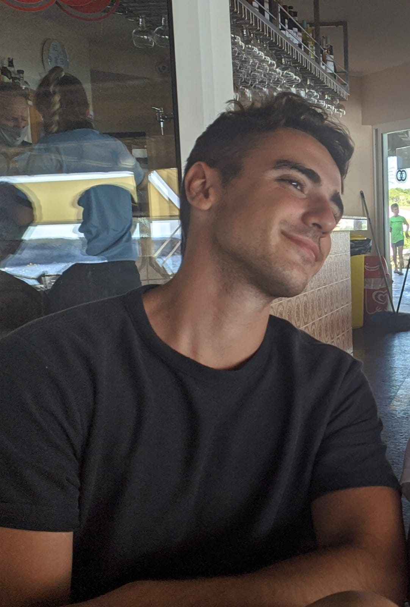

# Another Small Engine

Another Small Engine (or ASE for short) is a simple, lightweight Game Engine created for academic purposes. Authors are [Pau Fiol](https://github.com/paufiol) and [Aitor Luque](https://github.com/Aitorlb7), working under the supervision of [Marc Garrigó](https://github.com/markitus18) for the 3D Engines subject coursed in [CITM](https://www.citm.upc.edu/).

Our main focus has been in implementing and showcasing a shader pipeline.

### The Team

- Pau Fiol Lorente - [paufiol](https://github.com/paufiol)
  - GUI
  - GameObject and Components
  - Hierarchy & Inspector
  - Object transformation
  - Unity Like camera movement
  - Camera component
  - Gizmos
  - AABB & OOBB
  - Text Editor
  - Shader Programming
  - Time Handling
  - Skybox
  
- Aitor Luque Bodet - [Aitorlb7](https://github.com/Aitorlb7)
  - GameObject and Components
  - Object transformation
  - Render Pipeline
  - Importers
  - Hierarchy & Inspector
  - Serialization
  - Scene Management
  - Resource Management
  - Asset Explorer
  - Shader Pipeline
  - Uniforms Editor
  - Skybox

Pau Fiol | Aitor Luque
-------------------------- | --------------------------
 | 

### Showcase

## Engine Features
* Window configuration options
* OpenGl configuration options
* Render configuration options
* Hierarchy & Inspector
* GUI Docking
* Asset Explorer Window
* GameObject and Components
* Drag & Drop from Asset Explorer
* Camera(s) with frustum culling, able to preview the InGame Camera (In Game Cameras can be modified from Inspector, the editor camer is in Configuration>Camera)
* Unity-like camera movement
* Objects have Bounding Boxes for Optimisation (Bounding Boxes can be Toggled in Configuration>Draw)
* Object transformation via Gizmos
* Custom Style creator for DearImGui
* Serialization:
   * Meshes
   * Materials/Shaders
   * Models
   * Scene
* Scene Saving (File > Save Scene)
* Resource Management
   * Creation of Meta files
   * All resources handled by their UIDs
   * Importing, serializing and Loading through Resources
   * Assets Window and Explorer
   * Custom File Formats generated within Library
   
### High-level System Features
* Shader Pipeline: Load and render 3D models using shaders, and apply textures and materials to them.
  * Use Skybox.
  * Shader Uniforms can be edited and saved from within the inspector.
  * Model, View, Projection Matrices; Time; Camera Position; are all automatically provided to all shaders. 
  * Assign any shader / texture to any given Game Object.
* Text Editor: Click on Edit Shader on the inspector to open a Text Editor. It has color higlighting, basic navigation and text edition commands (Ctrl+C,Ctrl+X,Ctrl+V,Ctrl+Z...). Saving will also recompile the shader to be able to see real-time the changes. Any compilation errors will be shown in the console.
* Water Shader: Vertex shader uses 3 overlapping [Gerstner Waves](https://en.wikipedia.org/wiki/Trochoidal_wave) to achieve the desired shape, and the Fragment Shader uses Height and a Texture (in the showcase scene uses [Worley Noise](https://en.wikipedia.org/wiki/Worley_noise)) To combine colors as well as a bit of reflection.
* Reflection & Reflaction Shader: These are very straightforward shaders once a Skybox is properly setup.

### How to Use
* Mouse Wheel: Zooms camera forward and backwards.
* Alt + Right click: Rotate camera over mouse position or else selected game object.
* Alt + Center click(wheel): Pan camera.
* Left click: Select object / Use Gizmo.
* W: Set Guizmo to Translate mode
* E: Set Guizmo to Rotate mode
* R: Set Guizmo to Scale mode
* Guizmo modes can also be set via the Tool submenu in the main bar
* Importing options:
  * Right Click on an item in the explorer -> Import Asset
  * Hold Left Click on an item in the explorer and drag into the scene.
* Saving and Loading an Scene
  * File -> Save Scene -> Write the Name of scene -> Press Enter
  * File -> Load Scene -> Open the expandable select the scene -> Press Load

### Links

- [Source Code](https://github.com/paufiol/AnotherSmallEngine)
- [Releases](https://github.com/paufiol/AnotherSmallEngine/releases)
- [License](https://github.com/paufiol/AnotherSmallEngine/blob/master/LICENSE.txt)
